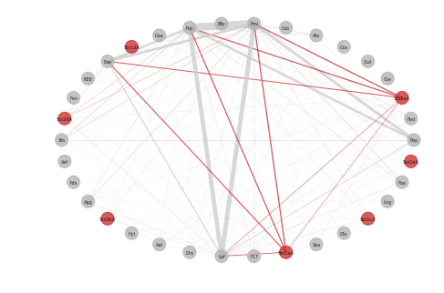
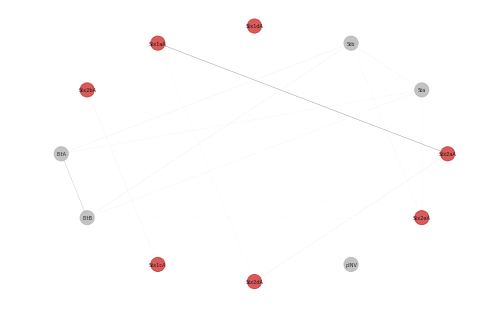

# Project of Escherichia coli

## Overview
[Escherichia coli](https://en.wikipedia.org/wiki/Escherichia_coli) is a Gram-negative, rod-shaped bacterium belonging to the family Enterobacteriaceae that was described in 1885 by a German pediatrician. Pathogenic E.coli is versatile due to the diversity of their gene sets. Virulence factors usually located on a virulence plasmid and can be acquired through gene transfer.Different combination of virulence factors may caused to different illness among human and animals. 

This time, we investigate the co-occurrance of virulence factors among all the available genome 
in the [Genbank](https://www.ncbi.nlm.nih.gov/genbank/). Meanwhile, we use phylogenetic tree to investigate relationship between different O/H serotype.

## Environment 
* [Python](https://www.python.org/download/releases/2.7/) 2.7( [Anaconda](https://www.anaconda.com/))

## Genome Download

### Install Wget 
On MacOs

    ruby -e "$(curl -fsSL https://raw.githubusercontent.com/Homebrew/install/master/install)"
    brew install wget

On Windows

    Download [wget](http://gnuwin32.sourceforge.net/packages/wget.htm)

### Download via accession number
According the [assembly_summary_genbank](ftp://ftp.ncbi.nlm.nih.gov/genomes/ASSEMBLY_REPORTS/assembly_summary_genbank.txt) in NCBI ftp site, we can get the genome through the organism name

    import os
    os.mkdir("Ecoli_genome")
    os.chdir("Ecoli_genome")
    with open(r'assembly_summary_genbank.txt') as f:
        for i in f.read().split('\n')[2:-1]:
            os.system('wget '+i+'_genomic.fna.gz')

or Use [Pandas](https://pandas.pydata.org/)
    
    import pandas as pd
    f=pd.read_table("assembly_summary_genbank.txt",sep='\t',header=1)
    for i in f[f['organism_name']=='Escherichia coli']['ftp_path']:
        os.system('wget '+i+'_genomic.fna.gz')

### Translate into amino acid sequence
Usually I only download fna file, and use [Prodigal](https://github.com/hyattpd/Prodigal) to translate nucleotide into amino acid sequence.

    for i in os.listdir('.'):
        order = 'prodigal -i '+i+' -q -a '+i'.faa'+' -d '+i+'.nucl'+' -o '+i+'.out'
        print order 
        os.system(order) 

Now we can get predicted protein sequence of all E.coli genomes. 

## Virulence Factors Detection
We use all protein sequence to run [BLAST](https://blast.ncbi.nlm.nih.gov/Blast.cgi) against a In-house collected gene set:

    cat *.faa > Ecoli.faa
    makeblastdb -in VF.faa -dbtype prot
    blastp -query Ecoli.faa -db VF.faa -out VF.blast -outfmt 6 -evalue 1e-10  -num_threads 8 -num_alignments 1

Result Analysis

    # Get_Strain_VF_Profile_Matrix:
    strain_profile={}
    vfs=[]
    with open(r'VF.blast') as f:
        data=f.read().split('\n')[-1]
        for i in data:
            strain=i.split('\t')[0].split('|')[0]
            if i.split('\t')[2] >= 60:
                if i.split('\t')[2] not in vfs:
                    vfs.append(i.split('\t')[2])
                if i.split('\t')[0].split('|')[0] not in strian_profile:
                    strain_profile[starin]=[i.split('\t')[1]]
                else:
                    strain_profile[strain].append(i.split('\t')[1])

    # Write File
    outfile=open(r'Strain_Profile.csv','w')
    outfile.write(' ,'+','.join(vfs)+'\n')
    for i in strain_profile:
        outfile.write(i)
        for j in vfs:
            if j in strain_profile[i]:
                outfile.write(',1')
            else:
                outfile.write(',0')
        outfile.write('\n')
    outfile.close()

Now we get the file of [Strain_Profile.csv](https://github.com/hzafeng/huifeng/tree/master/source/file)

Data visualization

Use UpsetR:

    # Show coexist between Agg subunit
    library(UpSetR)
    upset(f,order.by="freq",sets=c('Agg3A','Agg3B','Agg3C','Agg3D','Agg4A','Agg4B','Agg4C','Agg4D','Agg5A','AggA','AggB','AggC','AggD'))

    # Show co-exist between Stx toxin
    upset(f,order.by="freq",sets=c("Stx2aB","Stx2aA","Stx2bA","Stx1aA","Stx1aB","Stx2dB","Stx2bB","Stx1cA","Stx1cB","Stx2dA","Stx1dB","Stx2fA","Stx2fB","Stx1dA"))

    # Show co-exist between Bfp toxin
    upset(f,order.by = "freq",sets=c("BfpA","BfpB","BfpC","BfpD","BfpE","BfpF","BfpG","BfpH","BfpI","BfpJ","BfpK","BfpL","BfpP","BfpU"))

Use NetworkX

    # Show co-exist between Shiga toxin and [Simplified Adhesin Factors]
    import matplotlib.pyplot as plt
    import networkx as nx
    def get_co_oc_from_show_vfs(show_vf):
        cooc=[]
        with open(r'adhesin_simplify.csv') as f:
            data=f.read().split('\n')[:-1]
            for i in data:
                show_vf.append(i.split(',')[1])
        for i in range(len(show_vf)):
            for j in range(len(show_vf)):
                if j>i:
                    con=0
                    for k in strain_profile:
                        if show_vf[i] in strain_profile[k] and show_vf[j] in strain_profile[k]:
                            con+=1
                    if con != 0:
                        cooc.append((show_vf[i],show_vf[j],con))
    show_vf=['Stx1aA','Stx1cA','Stx1dA','Stx2aA','Stx2bA','Stx2dA','Stx2eA','Stx1aB','Stx1cB','Stx1dB','Stx2aB','Stx2bB','Stx2dB','Stx2eB']
    get_co_oc_from_show_vfs(show_vf)
    G.nodes()
    G=nx.Graph()
    G.add_weighted_edges_from(cooc)
    weights =[]
    weights= [w[2]['weight']*0.001 for w in G.edges(data=True)]
    node_color=[]
    for i in G.nodes():
        if 'Stx' in i:
            node_color.append('#CD3333')
        else:
            node_color.append('#B5B5B5')
    pos=nx.circular_layout(G)
    nx.draw(G, pos,node_size=200, width=weights,with_labels=True,font_size=5,node_color=node_color,edge_color=color,alpha=0.8)

Adhesin factors and heat stable toxin

Adhesin factors and heat labile toxin

All toxin

[PDF](https://github.com/hzafeng/huifeng/tree/master/source/images) version please click here

## In Silico Serotyping
To understand the relationship between different serotype and their virulence profile, we use [BLAST](https://blast.ncbi.nlm.nih.gov/Blast.cgi) based in silico methods to serotype E.coli via [SerotypeFinder](https://cge.cbs.dtu.dk/services/SerotypeFinder/).

    cat *.faa > Ecoli.faa
    makeblastdb -in serotype.faa -dbtype prot
    blastp -query Ecoli.faa -db serotype.faa -out EcoliSerotype.blast -outfmt 6 -evalue 1e-10  -num_threads 8 -num_alignments 1

